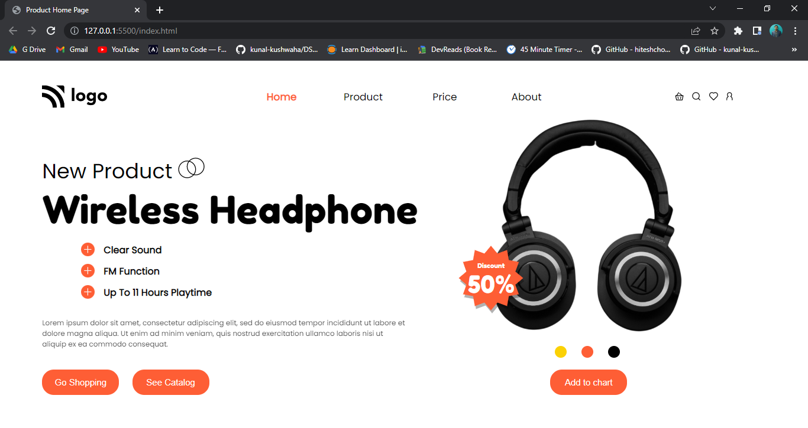
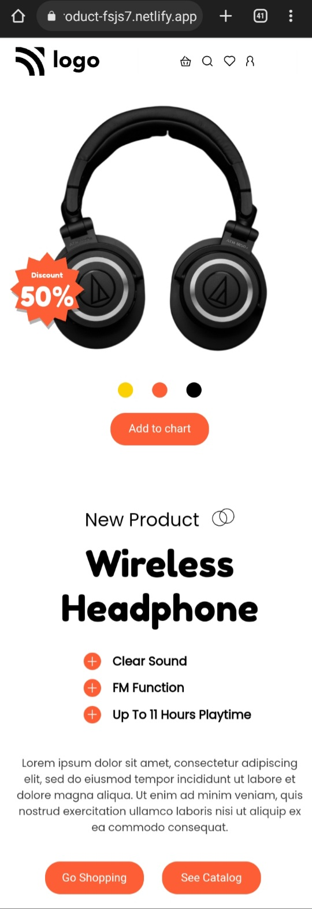

# Product Home Page

Hi 👋 I am Shobhan Sundar Goutam. This project is made with the help of `HTML` and `CSS`.

 

- ### Learnings from this project:-

  - Learned to use grid.
  - Learned to use attribute selector.
  - Learned to use `filter: drop-shadow()`.
  - Learned to make circles.
  - Learned to make responsive layouts with the help of css.
  - Learned to align items in smaller screens using grid.

- It took around _6 hours_ to complete.

- Live Link:- [Product Home Page](https://product-fsjs7.netlify.app/)

### Screenshot

### Mobile Layout:

